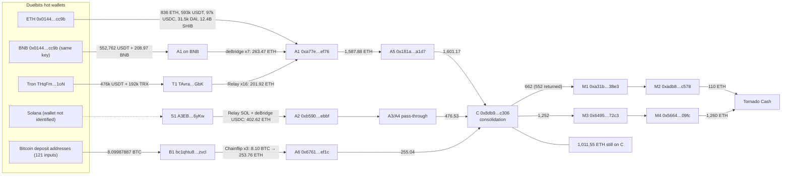

# Duelbits hot-wallet breach (24 Sep 2026): five-chain fund-flow trace

An independent, reproducible trace of the ~$7M theft from crypto casino Duelbits. It is built only from public block explorers and the public APIs of the bridges the attacker used. Every amount below is recomputed by [`scripts/verify_totals.py`](scripts/verify_totals.py), and the output is committed as [`data/reconciliation.txt`](data/reconciliation.txt).

Data cut-off: 3 October 2026, Ethereum block 26,113,697.

## Findings

1. **Five chains were drained, not four.** Reporting names Ethereum, BNB Chain, Tron and Bitcoin. The attacker also bridged **3,528.60 SOL and 675,244.80 USDC from a Solana address** into Ethereum within 45 minutes of the drain, worth about 402.6 ETH. No public report I found mentions a Solana leg.
2. **The "dormant" funds moved.** Media reported that ~2,234 ETH was consolidated and "has not moved". Between 26 and 28 September, **1,370 ETH went into Tornado Cash** in 20 deposits. As of 3 October, **1,011.55 ETH** remains on the consolidation address.
3. **One key, two chains.** Duelbits used the same hot-wallet address, `0x0144…cc9b`, on Ethereum and BNB Chain (nonce 63,798 on BNB). One compromised key exposed both. The attacker likewise used one address, `0xa77e…ef76`, on both chains.
4. **The reported asset list reconciles exactly on-chain.** The five Ethereum transfers out of the hot wallet (09:00:35–09:02:47 UTC) match the reported figures. So do the Tron leg (476,058.09 USDT + 192,470 TRX), the BNB leg (552,761.73 USDT + 208.97 BNB, against "209 BNB" reported) and the Bitcoin leg (8.09987887 BTC, against "8.1 BTC"). The press figure of "$1.62M in USDT" is the sum of all three chains: 593,430 + 476,058 + 552,762 = **1,622,250 USDT**.
5. **The Bitcoin theft was a sweep of ~121 inputs, not one wallet.** A single transaction at 09:42:45 UTC spent 121 inputs from dozens of distinct P2SH and bech32 addresses, the pattern of customer deposit addresses, and paid 8.09987887 BTC to the attacker. Signing it requires the keys of all those addresses. That points to compromise of an HD seed or of the signing service, not of one hot-wallet key. This is an inference from the transaction structure. The BTC then went through **Chainflip** (3 swaps: 2.00 + 3.00 + 3.10 BTC → 253.76 ETH), verified swap by swap in the Chainflip explorer.
6. **Every bridge leg reconciles by count and amount.** For example, 16 Tron→Relay deposits match 16 Relay fills on Ethereum, and 7 deBridge orders from BNB Chain match 7 fills.
7. **The attacker's own addresses are being address-poisoned.** Three lookalike contracts that mimic the consolidation and staging addresses share one implementation (`0xe6B9…43ed`), so a single poisoning operator is running them. Fake "ETH" and "USDT" tokens with Unicode names create noise in naive transaction histories. A tracer that trusts token names or `from` fields will mis-sum the flows.

## Flow of funds



The full address list, with the evidence behind each label, is in [`data/addresses.csv`](data/addresses.csv).

## Timeline (UTC)

| Time | Event |
|---|---|
| 24 Sep 08:58:36 | Tron hot wallet sends 476,058.09 USDT to T1. 192,470 TRX follows at 08:59:27. |
| 09:00:35–09:02:47 | Ethereum hot wallet sends DAI, SHIB, USDC, USDT, then 836 ETH to A1 (5 transactions in 132 s). |
| 09:04 | T1 approves a router and swaps the USDT for TRX. |
| 09:08–09:28 | T1 makes 16 Relay deposits (1,589,000 TRX) and receives 201.92 ETH at A1. |
| 09:12–09:55 | Solana leg: 4 deBridge orders (675,244.80 USDC) and 7 Relay requests (3,528.60 SOL) deliver 402.62 ETH to A2. |
| 09:14–09:23 | BNB leg: 7 deBridge orders created by A1 on BNB Chain deliver 263.47 ETH to A1 on Ethereum. |
| 09:27–09:46 | Ethereum tokens are swapped to ETH: USDT through Relay (224.10 ETH), USDC and SHIB through the deBridge router. |
| 09:42:45 | Bitcoin: one transaction sweeps 121 inputs and pays 8.09987887 BTC to B1 `bc1qhtu8…zvcl`. |
| 09:55:39 | B1 sends 2.00 BTC to a Chainflip deposit channel and 6.10 BTC onward. The 6.10 BTC re-enters Chainflip as 3.00 BTC (same morning) and 3.10 BTC (14:36). |
| 09:58–14:42 | The Chainflip Vault `0xf5e1…2bcc` pays out 62.64 + 94.09 + 97.03 = 253.76 ETH to A6 (Chainflip swaps 1843274, 1843322, 1843983). |
| 12:11–13:08 | Feeder addresses consolidate **2,234.70 ETH** into C. This is the figure later reported in the press. |
| ~15:48 | CoinDesk reports the hack; the funds are described as stationary. |
| 26 Sep 08:39 | First movement out of C: 662 ETH to M1. 110 ETH reaches Tornado Cash via M2 on 26–27 Sep. |
| 28 Sep 08:01–08:39 | 1,252 ETH moves from C to M3 and on to M4. M4 makes 18 Tornado Cash deposits (12×100 + 6×10 = 1,260 ETH). M3 also receives 9.958 ETH out of the Tornado 10 ETH pool, a withdrawal from a pre-existing note. |
| 30 Sep | A1 receives 12.45 ETH from the THORChain router. A1 forwards 38.02 ETH to C. |
| 3 Oct | C holds 1,011.55 ETH. |

## Reconciliation: where the 2,371.76 ETH on C came from

C received 2,234.70 ETH on 24 Sep, 99.04 ETH on 25 Sep and 38.02 ETH on 30 Sep, a total of 2,371.76 ETH. Every inbound ETH is either assigned to a source leg or listed as unresolved:

| Source leg | Original assets | ETH delivered | Status |
|---|---|---:|---|
| Ethereum hot wallet | 836 ETH + 593,430.32 USDT + 96,804.68 USDC + 31,515 DAI + 12.40B SHIB | 1,134.28 | Confirmed (direct transfers + swap receipts) |
| Solana | 3,528.60 SOL + 675,244.80 USDC | 402.62 | Confirmed via Relay and deBridge order data; fills verified on Ethereum |
| BNB Chain | 552,761.73 USDT + 208.97 BNB | 263.47 | Confirmed: 7 deBridge orders, assets itemised from the creation-tx receipts |
| Tron | 476,058.09 USDT + 192,470 TRX | 201.92 | Confirmed end to end |
| Bitcoin | 8.09987887 BTC | 253.76 | Confirmed: sweep tx + 3 Chainflip swaps (2.00 / 3.00 / 3.10 BTC) |
| Other inbound | high-volume EOAs, THORChain, small feeders | ~115.6 | Unresolved |
| **Total** | | **~2,371.7** | Matches C's inflow (2,371.76) |

At the ETH price at fetch time (~$2,685, Blockscout quote), 2,371.76 ETH is roughly **$6.4M**. Duelbits' co-founder stated "~$7M". The gap is consistent with slippage and bridge fees, price moves since the 24th, and assets the attacker did not bridge or that this trace did not reach. It is an open item, not a finding.

## What this means for compliance teams

**For iGaming operators (hot-wallet custody):**
- **Do not leave deposit-address keys reachable from the hot path.** The BTC sweep spent 121 deposit-address inputs in one transaction. If the keys of every customer deposit address derive from one online seed, one breach empties all of them.
- **Use one key per chain, or better, per wallet.** Here a single EVM key exposed Ethereum and BNB Chain together. The same address appearing on several chains with a high nonce is a cheap control-gap indicator to check in your own estate.
- **Treat drain speed as a detection metric.** The full Ethereum drain took 132 seconds, and the Tron and Ethereum wallets were both emptied within about 4 minutes. A withdrawal-velocity alert on hot wallets has to fire within seconds to matter.
- **Monitor all your chains.** The Solana loss was absent from public reporting. Either it was not disclosed or nobody looked. Your incident inventory should cover every chain where you hold a hot wallet.

**For exchanges and VASPs (screening inbound deposits):**
- The attacker relied on **intent-based bridges (Relay, deBridge)**, not lock-and-mint bridges. The bridge's own API links source and destination addresses, so these hops are *more* traceable than they look. Screening that stops at "came from a bridge contract" is leaving information unused.
- Addresses to screen, including those directly exposed to C and M1–M4, are in [`data/addresses.csv`](data/addresses.csv). Tornado Cash withdrawals that follow 26–28 Sep deposits of 100 ETH and 10 ETH denominations deserve extra scrutiny.
- **Address poisoning targets attackers too.** Lookalike addresses (same first and last characters) are actively seeded around C, M1 and M3. Analysts copying addresses from transaction history can paste a poisoned lookalike. Always match the full address.

## What could not be verified

- **Bitcoin key scope.** The "HD seed or signing service" reading of the 121-input sweep is an inference. I have not confirmed that every input address belonged to Duelbits. The 3.00 BTC and 3.10 BTC deposits reach Chainflip through intermediate addresses that I did not itemise hop by hop. The Chainflip explorer confirms the deposit amounts and the ETH payouts to A6.
- **BNB drain transactions.** No keyless BNB indexer was reachable (public RPCs reject `eth_getLogs`, and BscScan requires a bot check or an API key). The BNB assets are itemised from what A1 spent into deBridge, not from the drain transactions themselves.
- **Solana wallet.** I identified the attacker's Solana bridging address, not the Duelbits Solana wallet it was drained from.
- **Unresolved inbound (~115.6 ETH):** 60.00 ETH via high-volume EOA `0xf30b…0eb0` (behaves like an exchange or instant-swap hot wallet), 25.57 ETH via `0x3f3e…207b`, 14.81 ETH via `0x7c75…e44a`, 12.45 ETH via the THORChain router, and small amounts. The original assets behind these are unknown.
- **Post-mixer flows.** Tornado Cash breaks the deterministic link. No withdrawal is attributed to the attacker here, except the 9.958 ETH withdrawal paid *into* M3.
- **Root cause and attribution.** Neither is assessed. "Private-key compromise" comes from Scam Sniffer's public assessment and is not my finding. No actor attribution is made.
- **Post-incident dust.** On 28 Sep the Duelbits Ethereum hot wallet signed ~170 transfers of ~0.00002 ETH to distinct addresses. Whether this was Duelbits or the key holder, and why, is unknown.

## Method

1. **Seeds.** The two addresses published by CoinDesk (hot wallet and consolidation).
2. **Real-value filter.** Only native coins and canonical token contracts count (USDT, USDC, DAI, SHIB, WETH, WBTC). An outgoing token transfer counts only if the address signed the transaction. This removes spoofed `Transfer` events from poisoning contracts.
3. **Hop-by-hop expansion.** EOAs with few transactions are treated as attacker-controlled. Contracts and high-volume EOAs are terminals (services) and are labelled from explorer metadata.
4. **Cross-chain resolution.** Each bridge fill is resolved through the protocol's own index: deBridge stats API (`FulfilledOrder` → orderId → maker on the source chain) and the Relay requests API (sender, origin chain, origin transaction). The destination fill is then checked on the destination chain.
5. **Reconciliation.** Every leg is balanced (in = out + gas) before moving on. Totals are recomputed by script, never typed by hand.

## Reproduce

```bash
pip install requests pandas
python scripts/summarize.py eth 0xa77e24fe29d16e051e487ef4ea7b056cb05aef76 out/a1.txt 2026-09-24
python scripts/tron_flows.py out/tron.txt TAvraZZFCZbDSZoyqWWRRsBkFgZqKaCGbK
python scripts/bridges.py data/bridges.csv data/cluster.txt
python scripts/dln_only.py 0xa77e24fe29d16e051e487ef4ea7b056cb05aef76
python scripts/gaps.py            # BNB receipts + Chainflip Vault inspection
python scripts/btc_leg.py bc1qhtu84kz3y94lvgl2t05zk84tqh57grvd82zvcl
python scripts/verify_totals.py
```

No API keys are needed. Raw responses are cached in `data/raw/` on first run (git-ignored to keep the repository small).

| File | Contents |
|---|---|
| `data/addresses.csv` | Every address in the trace: role, label, evidence |
| `data/debridge_orders.csv` | All 11 deBridge orders (BNB and Solana → Ethereum) with source and destination transactions |
| `data/bridges.csv` | All Relay requests for the cluster (Tron and Solana → Ethereum, plus same-chain swaps) |
| `data/bnb_receipts.csv` | Tokens A1 spent on BNB Chain in each deBridge order-creation tx (from receipts) |
| `data/btc_leg.csv` | Bitcoin history of the attacker's address B1, including the 121-input sweep |
| `data/reconciliation.txt` | Output of `verify_totals.py` |
| `scripts/` | Explorer and bridge clients, flow summariser, BFS tracer, Tron decoder, verification |

## Sources

- CoinDesk, "Crypto casino Duelbits goes offline after $7 million hot wallet hack", 24 Sep 2026: victim and consolidation addresses, reported asset list
- GBHackers / Bitcoin.com News, 25 Sep 2026: BNB, TRX and BTC figures
- On-chain: eth.blockscout.com, api.trongrid.io, bsc-dataseed.bnbchain.org (receipts), blockstream.info, stats-api.dln.trade, api.relay.link, scan.chainflip.io (swaps 1843274, 1843322, 1843983)

---

*Independent research from public data. Labels describe on-chain behaviour, not legal conclusions. Corrections are welcome via issues.*

Anton Melanin · [LinkedIn](https://linkedin.com/in/antonmelanine) · Paphos, Cyprus
